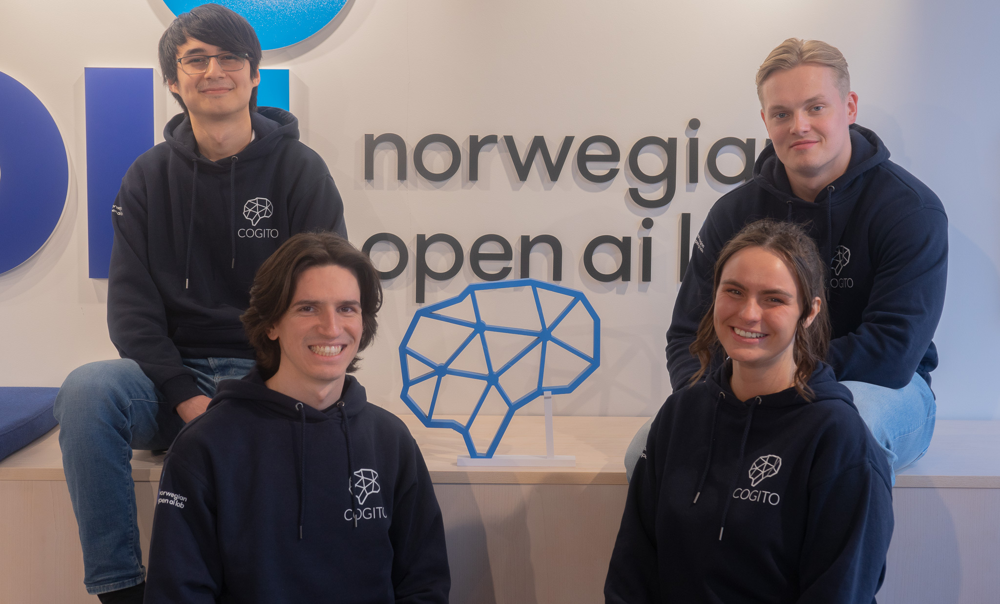

# Diffusion Model

<div id="top"></div>

<!--INSERT PICTURE REPRESENTATIVE OF PROJECT-->
<div align="center">
</img>
</div>
<p align="center">
<a href="https://github.com/CogitoNTNU/README-template/blob/main/LICENSE" alt="LICENSE">
        </img></a>

<a href="" alt="platform">
        </img></a>
<a href="" alt="version">
        </img></a>
</p>
<h3 align="center">Diffusion Model</h3>
<!-- TABLE OF CONTENTS -->
<details>
  <summary>Table of Contents</summary>
  <ol>
    <li>
      <a href="#about">About</a>
    </li>
    <li>
      <a href="#getting-started">Getting Started</a>
      <ul>
        <li><a href="#prerequisites">Prerequisites</a></li>
        <li><a href="#installation">Installation</a></li>
      </ul>
    </li>
    <li><a href="#usage">Usage</a></li>
   <li><a href="#team">Team</a></li>
    <li><a href="#license">License</a></li>
  </ol>
</details>

## Description 
-----
The aim of this project is to create our own Deep Learning model that **generates brand new car images**. We develop our home-made unconditional image generation model based on the paper [*Denoising Diffusion Probabilistic Models*](https://arxiv.org/abs/2006.11239) from *Jonathan Ho, Ajay Jain, Pieter Abbeel* in 2020. We followed the structure of the article and implemented main function to recreate an unconditional image generator, based on the diffusion process.


## Quick Start

### Prerequisites
- Ensure that git is installed on your machine. [Download Git](https://git-scm.com/downloads)
- Docker is used for the backend and database setup. [Download Docker](https://www.docker.com/products/docker-desktop)

### Clone the repository

```bash
git clone https://github.com/CogitoNTNU/DiffusionModel.git
cd DiffusionModel
```
Done! You are now ready to generate cars!


## Usage
------
In this section you describe how to use the program to obtain the desired result.  

## Team
------
The team behind this project is a group of students at NTNU in Trondheim, Norway, developed during the spring semester of 2024. 

<table align="center">
  <tr>
    <td align="center">
        <a href="https://github.com/soricm">
            <br />
            <sub><b>Marijan Soric</b></sub>
        </a>
    </td>
    <td align="center">
        <a href="https://github.com/ThomasHWik">
            <br />
            <sub><b>Thomas Haslund Wik</b></sub>
        </a>
    </td>
    <td align="center">
        <a href="https://github.com/Mauritzskog">
            <br />
            <sub><b>Mauritz Skogøy</b></sub>
        </a>
    </td>
    <td align="center">
        <a href="https://github.com/amandathunes">
            <br />
            <sub><b>Amanda Truyen</b></sub>
        </a>
    </td>
    <td align="center">
      <a href="https://github.com/BarisBatur">
          <br />
          <sub><b>Baris Batur</b></sub>
      </a>
    </td>
  </tr>
</table>

This project would not have been possible without the hard work and dedication of all of the contributors. Thank you for the time and effort you have put into making TutorAI a reality.

<div align="center">
    


Right to left: [@BarisBatur](https://github.com/BarisBatur), [@soricm](https://github.com/soricm) *(Team leader)*, [@amandathunes](https://github.com/amandathunes), [@Mauritzskog](https://github.com/Mauritzskog).
*([@ThomasHWik](https://github.com/ThomasHWik) isn't in the picture day)*

### License
------
Distributed under the MIT License. See `LICENSE` for more information.


### Credits
------
Template by [@JonRodtang](https://github.com/Jonrodtang) for  [@CogitoNTNU](https://github.com/CogitoNTNU)  <p align="right">(<a href="#top">back to top</a>)</p>
